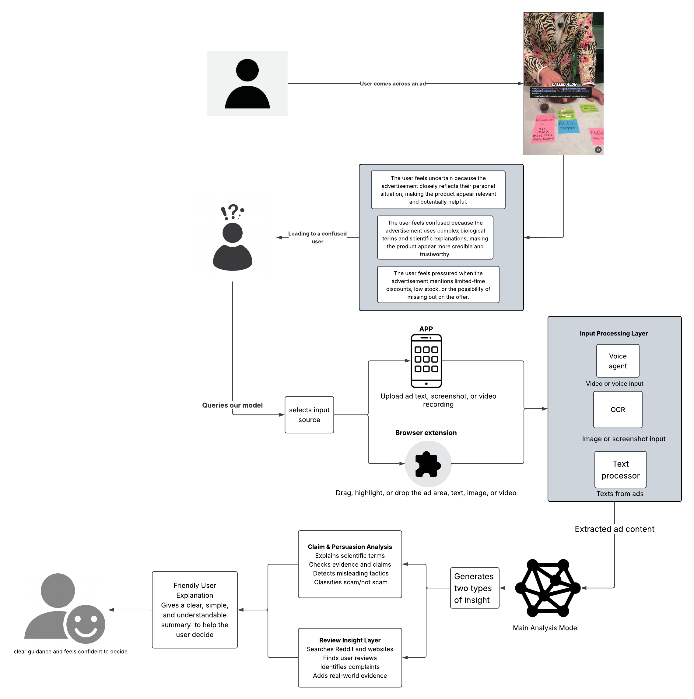

# AdInsight — Persuasion-Aware Ad Explainer

*Helping users understand the persuasion behind every advertisement.*

An NLP system for detecting emotionally manipulative advertising tactics.

[Report](docs/AdInsight_Final_Report.pdf) | [Slides](docs/slides.pdf) | [Demo](app/README.md) |

**Group 6 — Final Project**
[Shashank Ashoka](https://github.com/shashk09-coder), [Christopher Pedretti](https://github.com/cpedrett-umd), [Ciara Cameron](https://github.com/Ciaracam), [
Jonathan Kim](https://github.com/Jonathan5108) .

---

## Abstract

Online advertisements routinely employ emotionally persuasive language to influence consumer behavior — particularly targeting older adults with health, financial, and wellness products. We present a multi-modal NLP pipeline that ingests ad content from text or images, detects persuasion tactics at the phrase level, and returns plain-language explanations alongside real-world review evidence. The system is designed for users aged 60 and older who encounter such ads on Facebook, Instagram, YouTube, and news websites, and who may lack a reliable method for evaluating ad credibility before engaging. Unlike approaches that classify ads as fraudulent or legally misleading, our system focuses on **awareness and transparency**: explaining *why* a piece of language is persuasive and *what tactic it employs*, without making legal judgments.

---

## System Overview



The pipeline operates in four stages. A confused user who encounters an emotionally loaded ad submits it through one of two interfaces. The input processing layer normalizes the submission into raw text regardless of modality. The main analysis model produces two parallel outputs: a claim and persuasion analysis, and a review insight layer that grounds the analysis in external evidence. These are merged into a single friendly explanation returned to the user.

---

## Method

### Input Interfaces

The system accepts ad content through two surfaces:

**App** — Users upload ad text or a screenshot directly.

**Browser Extension** — Users drag, highlight, or drop an ad region, text block, or image from any webpage.

### Input Processing Layer

Raw submissions are routed through two parallel processors depending on modality:

| Input Type | Processor |
|---|---|
| Image or screenshot | OCR (optical character recognition) |
| Raw ad text | Text processor (direct tokenization) |

Both paths emit a unified extracted-text representation passed downstream.

### Main Analysis Model

The extracted ad content is analyzed by a central NLP model that generates two types of insight simultaneously:

**Claim and Persuasion Analysis**
- Explains scientific or technical terms used in the ad
- Checks whether stated claims are supported by evidence
- Detects and classifies emotionally manipulative tactics
- Issues a scam / not-scam signal (informational, not legal)

**Review Insight Layer**
- Searches Reddit threads and consumer review websites
- Retrieves real user reviews for the advertised product or service
- Identifies recurring complaints and negative patterns
- Surfaces real-world evidence alongside the model's internal analysis

### Persuasion Tactics Detected

| Tactic | Description | Example Trigger Language |
|---|---|---|
| Urgency | Creates artificial time pressure | "Act now", "Offer ends tonight" |
| FOMO | Exploits fear of missing out | "Everyone is switching to...", "Don't miss out" |
| Fear Appeals | Induces anxiety about health or safety | "Without this, you risk...", "Doctors are alarmed" |
| Scarcity | Implies limited availability | "Only 3 left", "Limited supply" |
| Exaggerated Claims | Makes unsubstantiated or inflated promises | "Cures in 24 hours", "Guaranteed results" |
| Authority Manipulation | Invokes false or unverifiable authority | "As seen on TV", "Doctor-approved" |
| Social Proof | Uses crowd behavior to validate the product | "Over 1 million satisfied customers" |

### Output

The two analysis branches are merged into a **friendly user explanation**: a clear, concise, plain-language summary that helps the user decide whether to trust the ad, without requiring them to interpret model outputs directly.

---

## Target Population

The primary user group is adults aged 60 and older. This group is disproportionately exposed to ads for health products, supplements, insurance, and financial services, and may encounter persuasion techniques — personal relevance framing, pseudo-scientific language, and artificial scarcity — that are difficult to identify without prior media literacy exposure. The system is designed to require no technical knowledge to use.

The tool generalizes to any consumer affected by emotionally persuasive advertising, including younger users encountering influencer marketing, FOMO-driven promotions, or misleading wellness claims.

---

## Project Status

**The system runs end to end today.** An ad goes in as text or as a screenshot,
and a plain-language explanation of its persuasion tactics comes out — through
either a desktop app or a browser extension.

| Stage | State |
|---|---|
| Data engine — collection, cleaning, labeling | **Done** — 3,230 labeled ads, 7 classes |
| Tokenizer | **Done** — HuggingFace subword, `max_len=128` |
| Tactic classifier | **Done** — test macro F1 **0.896**, weights committed |
| Input processing — text + OCR | **Done** — live OCR at request time |
| Explanation layer | **Done** — [`app/tactics.py`](app/tactics.py) |
| Review-insight layer | **Not built** — stubbed, flagged in the UI |
| App surface | **Done** — [`app/`](app/README.md) |
| Browser-extension surface | **Done** — [`extension/`](extension/README.md) |
| Usability testing with adults 60+ | **Not started** — the next milestone |
| Tests | **Done** — 126 Python + 57 JavaScript |

**Known limitation worth stating up front.** The labeled dataset contains no
`Neutral` rows, so the classifier has no way to report "this ad is fine" — it
must name one of the seven tactics for every input. On a genuinely clean ad it
does so confidently (a bakery's opening-hours ad scores 75.8% Social Proof).
A low-confidence guard suppresses the weakest of these, but not all; see
[samples/README.md](samples/README.md). The fix is dataset-side — add Neutral
examples and retrain.

**Decision: persevere.** The problem — and users' appetite for third-party
evidence — is validated by published consumer research (FTC Consumer Sentinel,
AARP fraud surveys, BrightLocal, YouGov). The main open question is usability,
which drives the rest of the semester.

**The data engine.** A multi-modal collection pipeline funnels two input types
into one labeled dataset:

- **7,768** ad texts in the unified dataset
- **2** input modalities piloted — text (regex-based ad-copy scraping) and
  image (OCR over ad screenshots)
- **8** annotation labels — the 7 persuasion tactics above plus *neutral* —
  with written [labeling guidelines](docs/labeling_guidelines.md)
- A HuggingFace subword tokenizer ([modeling/](modeling/)) that prepares the
  text for the classifier

**Scope change — audio dropped.** Voice/video (ASR) collection proved
inconsistent and hard to standardize, so the audio modality was removed and
effort was redirected to text and image. (Prior ASR work is retained under
`datasets/audio_processing (deprecated)/`.)

**North-star metric:** macro F1 across the 7 persuasion-tactic classes.

### The tactic classifier

DistilBERT fine-tuned on the 3,230 labeled ads, with the training configuration
chosen by a Hyperopt TPE search (`modeling/train_hyperopt.py`). The winning
configuration — lr 5e-5, batch 16, 3 epochs, weight decay 0.0 — scores on the
held-out test split (15%, stratified):

| Metric | Score |
|---|---|
| **Macro F1** (north star) | **0.896** |
| Accuracy | 0.909 |
| Weighted F1 | 0.911 |

Per-class F1 ranges from 0.77 (Social Proof, the smallest class at 198 examples)
to 0.98 (Fear Appeals). Class weighting in the loss compensates for the ~4.6x
imbalance.

The weights are committed via Git LFS as **float16** (134 MB rather than 268 MB).
float16 changes none of the 485 held-out test predictions and leaves macro F1 at
0.8956, so the extra precision would be pure clone cost; `app/predict.py` casts
back to float32 at load. After retraining, run `python compress_model.py` before
committing, or the repo gains a 268 MB file.

### Road to demo day

1. ~~Merge & annotate the multi-modal dataset~~ — done
2. ~~Train & evaluate the tactic classifier~~ — done, macro F1 0.896
3. Build the explanation & review-insight layers — explanation layer done
   (`app/tactics.py`); review-insight layer still stubbed
4. ~~Ship the app & browser-extension MVP~~ — both surfaces working
   (`app/`, `extension/`)
5. Usability tests with adults 60+ → demo day

---

## Repository Structure

```
Group-6-Final-Project/
├── datasets/
│   ├── text_processing/                    # Ad-text dataset + tokenizer artifacts
│   │   ├── ads_dataset_labeled.csv         # Labeled dataset (3,230 ads, 7 tactic classes)
│   │   ├── ads_tokenizer/                  # Saved HF tokenizer (vocab + config)
│   │   ├── tokenized_ads.pt                # Pre-tokenized dataset, ready to load
│   │   ├── label_ads.py                    # Labeling helper script
│   │   ├── main.py                         # Dataset cleaning / build script
│   │   ├── requirements.txt
│   │   └── ads_dataset_*(deprecated).csv   # Earlier dataset iterations, kept for reference
│   └── audio_processing (deprecated)/      # Prior ASR experiment (video ads)
├── modeling/                               # Tokenizer + tactic classifier
│   ├── hf_tokenizer.py                     # AdsTokenizer + dataset-tokenization script
│   ├── train_baseline.py                   # Baseline DistilBERT fine-tune
│   ├── train_hyperopt.py                   # Hyperopt (TPE) search over the training config
│   ├── train_best.py                       # Trains just the winning config → saved weights
│   ├── compress_model.py                   # Converts saved weights to fp16 before committing
│   ├── hyperopt_results/                   # Trial table, best parameters, best model (LFS)
│   ├── requirements.txt
│   └── README.md                           # Tokenizer usage + artifact details
├── app/                                    # App surface — the wireframe, working
│   ├── server.py                           # Flask API + static serving
│   ├── desktop.py                          # Same UI as a native desktop window
│   ├── predict.py                          # Tuned model → label + confidence
│   ├── ocr.py                              # Ad screenshot → text (RapidOCR)
│   ├── tactics.py                          # Trigger-phrase lexicon + plain-language copy
│   ├── reviews.py                          # Stub for the review-insight layer
│   ├── static/                             # index.html, styles.css, app.js, demo-page.html
│   ├── requirements.txt
│   └── README.md                           # Setup, the three inputs, API shape
├── extension/                              # Browser-extension surface (Chrome MV3)
│   ├── manifest.json
│   ├── background.js                       # Service worker — network + context menus
│   ├── content.js                          # Overlay: ad detection, pick mode, rendering
│   ├── panel.css                           # Overlay styles (shadow-root scoped)
│   ├── popup.html / popup.js               # Toolbar popup
│   ├── tests/                              # 57 tests (node:test + jsdom)
│   └── README.md
├── samples/                                # Test material with measured results
│   ├── ad_texts.md                         # Nine ad texts to copy-paste
│   ├── images/                             # Four ad screenshots for the OCR path
│   └── README.md                           # What each one should produce
├── tests/                                  # 126 Python tests (pytest)
├── docs/                                   # Project docs and reference material
│   ├── project_overview.pdf
│   ├── labeling_guidelines.md
│   ├── Group6_MidSemester_Presentation.pptx
│   └── workflow_ad_explainer.png           # System architecture diagram
├── weekly_reports/                         # Per-week progress reports
├── .gitattributes                          # Git LFS tracking for *.safetensors
├── .gitignore
└── README.md
```

The abstract above describes the full planned system. The repository now covers
all of it except the **review-insight layer**, which is stubbed in
`app/reviews.py` and clearly flagged as sample data in both front ends.

---

## Run it yourself

Works on **macOS, Windows, and Linux**. Python 3.10+. Nothing needs a compiler
or a system-level installer — every dependency ships wheels, Apple Silicon
included.

### 1. Clone

The model weights live in **Git LFS**, so install it *before* cloning:

```bash
git lfs install
```

```bash
git clone https://github.com/cpedrett-umd/Group-6-Final-Project.git
```

Already cloned without LFS? The checkpoint will be a small text pointer instead
of real weights. Fix it with `git lfs pull`.

### 2. Install

```bash
pip install -r requirements.txt
```

That covers everything — model, both front ends, dataset scripts, tests. (The
per-directory files still exist if you only want one piece.) The first OCR run
downloads ~15 MB of ONNX models.

### 3. Run

There are two surfaces, and they set up differently. **The app is standalone;
the extension needs the server running behind it.** Pick one:

- [**A — Run the app**](#a--run-the-app) — one command, nothing to install
- [**B — Install the browser extension**](#b--install-the-browser-extension) — start the server, then load it in Chrome

Run every command from the **repository root**.

---

## A — Run the app

The quickest path. Nothing to install, no browser involved.

```bash
python app/desktop.py
```

A native window opens. That's it — the model loads at startup (~10s), then
you can paste ad text or upload a screenshot.

It binds to a port the OS picks, so it **never collides** with a server you
already have running. Closing the window shuts it down.

<details>
<summary>Prefer it in a browser tab instead?</summary>

```bash
python app/server.py --warm
```

Prints `Running on http://127.0.0.1:5000` — open that. Same UI. The server runs
in the **foreground**, so keep the terminal open; `Ctrl+C` stops it.

| Flag | Effect |
|---|---|
| `--warm` | Loads the model at startup (~10s) instead of on the first click. Worth it before a live demo. |
| `--port 8000` | Use a different port. |
| `--host 0.0.0.0` | Accept connections from other machines on your network. |

</details>

---

## B — Install the browser extension

Chrome or Edge. It's loaded unpacked — this is a course project, not a store
listing.

#### Step 1 — Start the server

The extension is only a front end; the model runs here. **It must stay running
the whole time you use the extension.**

```bash
python app/server.py --warm
```

Wait for `Running on http://127.0.0.1:5000`, and leave that terminal open.

#### Step 2 — Open the extensions page

Go to **`chrome://extensions`** (or `edge://extensions` on Edge). Typing it into
the address bar is the reliable way — it's also under ⋮ → Extensions → Manage
Extensions.

#### Step 3 — Turn on Developer mode

Toggle **Developer mode**, top-right of that page. Without it, the *Load
unpacked* button doesn't appear.

#### Step 4 — Load unpacked

Click **Load unpacked**, then select the **`extension/`** folder inside this
repository — the folder itself, not any file inside it. It's the one containing
`manifest.json`.

An *AdInsight* card should appear. Version 0.1.0, no errors.

#### Step 5 — Pin it to the toolbar

Click the puzzle-piece icon in Chrome's toolbar, find **AdInsight**, and click
the pin. Easy to skip, but the popup is where *Pick an ad on this page* and the
server status live.

#### Step 6 — Try it

Open the demo article the server hosts:

**<http://127.0.0.1:5000/demo-page>**

Then use any of these:

| Action | What happens |
|---|---|
| **Hover** the sponsored NeuroVital block | An *Analyze this ad* button appears — click it |
| **Select** any paragraph | Same button, labeled *Analyze this text* |
| Toolbar icon → **Pick an ad on this page** | Hover anything, click to analyze. Works on sites the auto-detector misses |
| **Right-click** an image → *Analyze this ad image* | Runs OCR, then the model |

Then try a real news site. Note that ads inside **cross-origin iframes** —
most programmatic ad slots — can't be read by any extension; use pick mode on
the surrounding text, or right-click the image.

#### If something's off

| Symptom | Fix |
|---|---|
| Popup says "Server not running" | Step 1's terminal has stopped. Restart it. |
| Nothing happens on hover | The block isn't marked up as an ad. Use **Pick an ad on this page**. |
| Panel never appears | Reload the page. Content scripts only inject on page load. |
| You edited an extension file | Press the reload icon on the AdInsight card, *then* refresh the page. |
| "Service worker (inactive)" | Normal — MV3 workers sleep and wake on demand. |
| Server on a different port | Set it in the popup under **Server address**. |

---

### Checking it's healthy

```bash
curl http://127.0.0.1:5000/api/health
```

`{"model_ready":true,"ocr_backend":"rapidocr"}` means everything is ready.
`model_ready: false` → run `git lfs pull`. `ocr_backend: null` → image uploads
won't work, reinstall with `pip install -r requirements.txt`. Both surfaces also
show a banner when either is missing, so nothing fails silently mid-demo.

**"Address already in use"** means a server already holds that port. Use it,
pass `--port`, or stop the old one:

```bash
# Windows
netstat -ano | findstr :5000
taskkill /PID <pid> /F
```

```bash
# macOS / Linux
lsof -ti:5000 | xargs kill
```

### 4. Try it on the sample ads

[`samples/`](samples/README.md) has nine ad texts and four ad screenshots, with
**the results each one actually produces** recorded alongside.

- **Paste text** — copy any block from [samples/ad_texts.md](samples/ad_texts.md)
  into the *Paste ad text* box.
- **Upload an image** — drop any file from `samples/images/` into the
  *Upload ad image* tab. OCR reads the words off it, and the panel shows you
  what it read before the verdict, so a bad scan is visible rather than silently
  driving the answer.
- **In the extension** — on the demo page, hover the sponsored block for the
  *Analyze this ad* button, select any text, or right-click an image. For ads
  the automatic detector misses, use **Pick an ad on this page** from the
  toolbar popup: hover anything, click to analyze.

Quick check that the whole pipeline works, without any UI:

```bash
curl -X POST http://127.0.0.1:5000/api/analyze -F "image=@samples/images/supplement_ad.png"
```

Expected on that file: six tactics, OCR confidence ~98%. `bakery_ad.png` is the
deliberate counter-example — it is a clean ad, and the model still flags it,
for the reason in **Known limitation** above.

## Tests

```bash
python -m pytest tests/ -q
```

```bash
cd extension/tests && npm install && npm test
```

183 tests — **126 Python** over the analysis pipeline and API, **57 JavaScript**
over the extension overlay (Node's built-in runner + jsdom; no browser or server
needed). Tests that need the weights, an OCR backend, or a system font skip
rather than fail, so a fresh clone runs green.

See [tests/README.md](tests/README.md) for what's covered and which real bugs
these caught.


## Team

| Name | Contribution |
|---|---|
| Chris Pedretti | Engineering, Data&Eval |
| Shashank Ashoka | Architecture, OCR, Agents |
| Ciara Cameron | Review insight layer, external evidence retrieval |
| Jonathan Kim | App interface and browser extension |

---

## Notes

This system is built for **educational awareness and media literacy**. It does not provide legal classification of advertisements as fraudulent or deceptive under any regulatory standard. Persuasion tactic labels are informational signals intended to help users think critically about ad language, not definitive judgments about a product or advertiser.
